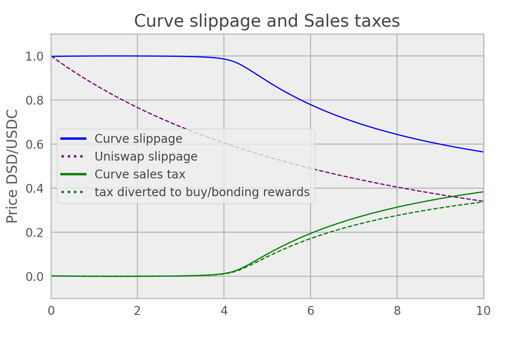

# DSD DIP-14 Simulations


Install packages
```
python setup.py install
```

Run Stableswap plots script
```
ipython -i stableswap_plots.py
```




Run Uniswap sales tax simulation scripts
```
ipython -i main_uniswap.py
```

Run Curve AMM sales tax simulation scripts
* currently producing buggy results, fix in progress
```
ipython -i main_curve.py
```

